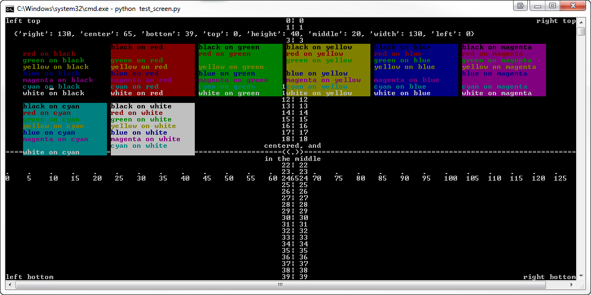

doscmd-screen
=============

 -- Screen positioning and colors in the dos shell (and unix too)

.. image:: https://readthedocs.org/projects/doscmd-screen/badge/?version=latest
   :target: https://readthedocs.org/projects/doscmd-screen/?badge=latest
   :alt: Documentation Status

Installation
------------
::

   pip install doscmd-screen

Changes
-------
Version 1.0.3 introduces thread safe window areas through the Window class.

Changes in version 1.0 include support for non-dos platforms, a visual
test script, and zero-based indexing of screen positions. Since the last
one is a backwards incompatible change I have upped the major version 
number. I don't forsee any further backwards incompatible changes in 
this module.

Documentation
-------------

The documentation lives at http://doscmd-screen.readthedocs.org/

Usage
-----

Straight forward positioning and terminal colors in the terminal::

    import screen  # screen probably needs to be your first import.
    scr = Screen()
    scr.centerxy(scr.center, scr.middle, '((.))')

    scr.writexy(scr.left, scr.bottom, 
                'left bottom', 
		        color='black', on='red')

Works for both Windows..

..
   https://dl.dropboxusercontent.com/u/94882440/screenshot-dos.png

..and unix-like terminals:

.. image:: https://dl.dropboxusercontent.com/u/94882440/screenshot-linux.png

